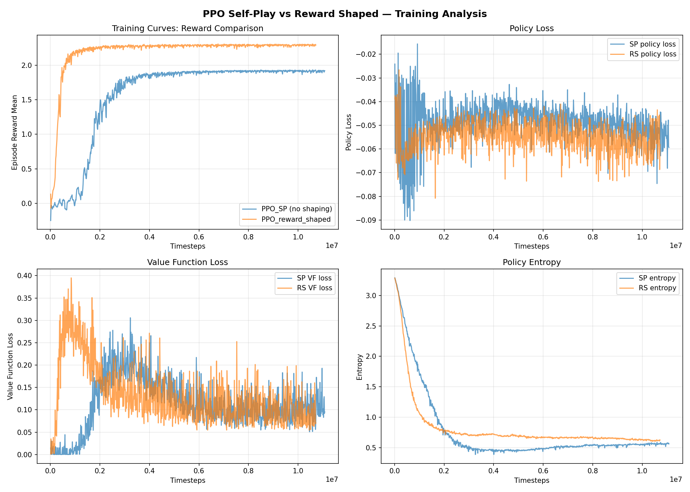

# 训练优化计划：68% → 90% vs CEIA Baseline

## 当前状态（2026-04-21）

**最佳模型**：checkpoint-5050，**81.4% 胜率** vs ceia_baseline（500 局评估）；checkpoint-5122 为 **83%**（500 局）

### 关键发现：CEIA Baseline 是确定性策略

老师确认 ceia_baseline_agent 使用**确定性策略**（给定相同 observation，永远做相同动作）。这意味着：
- 理论上限是 **100% 胜率**，87% 不是天花板
- 每次输球都是 agent 自身策略不够好，不是对手"运气好"
- Baseline 的进攻模式是固定的 — agent 只需学会识别并应对这几种固定套路
- **防守优化**是突破口：输球分析显示被快速进球（avg 24.5 步），这些进攻模式是可被完全预测和防御的
- 更多针对 ceia 的训练是正确方向，但需保持 entropy 防止策略坍缩

### 已尝试的策略和结果

| # | 策略 | 结果 | 结论 |
|---|------|------|------|
| 1 | PPO 超参数优化（entropy, GAE, grad_clip 等）+ 100% ceia | checkpoint-4650: 80%, checkpoint-5122: **87%** | 有效，从 68% → 87% |
| 2 | 继续 100% ceia 训练 | checkpoint-5749: 83% | 过拟合退化 |
| 3 | 70% ceia + 30% selfplay | checkpoint-5750: 86% | 防止退化但未突破 |
| 4 | BC 预训练 + PPO fine-tune | reward 0.078 | 完全失败（distribution shift） |
| 5 | 高 entropy (0.01) + 高 lr (1e-4) | checkpoint-5650: 84% | 退化 |
| 6 | [512,512] 大网络从零训练 | checkpoint-591: 6% | 训练不足 |

### 正在进行的实验

| # | 策略 | 假设 |
|---|------|------|
| C | Reward 权重微调（kick 2x, offensive 2x, defensive 0.5x, 去 time penalty） | 默认 reward 权重在高水平对抗中次优 |
| D | 分离 policy/value 网络（vf_share_layers=False） | 共享网络的 VF loss 干扰 policy gradient |

### 未尝试的方向

- Observation normalization（running mean-variance）
- 续训 [512,512] 多轮（实验 B 只跑了 591 轮，reward 趋势良好）
- Orthogonal initialization
- Adam epsilon = 1e-5

---

## 原始计划（2026-04-14）

以下是最初的优化计划，已大部分执行完毕。保留作为参考。

---

## Context（原始）

当前最强 checkpoint-2429（`train_PPO_team.py`，50% ceia 对打）vs ceia_baseline 胜率 68%，目标 90%。训练历史显示严重不稳定（62% → 15% → 56% → 68%）。

**根本原因**：所有训练脚本均未设置关键 PPO 超参数，使用 Ray 1.13.0 默认值，其中多项对本任务严重不合适（已通过 `DEFAULT_CONFIG` 确认）。

## 前置分析：Frank 的训练迭代历史

Frank 从 4 月 5 日起在 PACE 上持续迭代，经历了 4 个阶段。以下分析总结了每个阶段的策略、结果和教训。

### 阶段 1：Reward Shaping + Self-Play（4/5 — 4/10）

- 重写了 `RewardShapingWrapper`（6 个奖励信号），用 `train_ray_selfplay.py` 从头训练
- 发现 GPU 对这个任务无收益（Unity 仿真不用 GPU，MLP 太小），之后全部改用 CPU
- checkpoint-700 vs ceia: **46%** 胜率

**教训**：纯 self-play 的 agent 学会了打自己，但没学会打 ceia。

### 阶段 2：续训 + 对手更新阈值调整（4/10 — 4/12）

- 从 checkpoint-700 续训，调整对手更新阈值
- checkpoint-1000: **62%**（最佳）
- checkpoint-1900: **15%**（暴跌）
- checkpoint-2000: **15%**（持续低迷）

**教训**：self-play 训练极不稳定，胜率从 62% 暴跌到 15%。原因是对手更新过于频繁 + 无 grad_clip，一次大梯度更新可以摧毁已学到的策略。

### 阶段 3：League Self-Play — 引入 ceia 对手（4/13）

- 发现纯 self-play 的问题后，创建了 `train_ray_selfplay_league.py`，15% 概率和 ceia 对打
- 但发现信号被稀释：agent 0-3 都可能被映射为 "default"，导致 default 一半时间在跟自己打，reward 接近 0
- checkpoint-1000 (league): **43%**（反而更差）

**教训**：15% ceia 比例太低，且 policy mapping 设计导致训练信号被稀释。

### 阶段 4：Team 训练 — 50% ceia + cooldown（4/13 — 4/14）

- 创建 `train_PPO_team.py`，关键改进：
  - Team 0（agents 0,1）固定用 "default"，Team 1（agents 2,3）从对手池采样
  - 50% ceia 对打 + 30% selfplay_1 + 20% selfplay_2
  - 加入 cooldown（20 轮间隔）防止对手更新过于频繁
- checkpoint-2296: **56%**
- checkpoint-2429: **68%**（当前最佳）

**教训**：增加 ceia 比例 + 修复 policy mapping + 加 cooldown 都有效，但 68% 离 90% 仍有差距。

### 训练曲线分析



- **左上 (Reward)**：RS 收敛更快（~1M 步）且更高（2.3 vs 1.9），说明 reward shaping 加速学习
- **右上 (Policy Loss)**：SP 前期尖刺剧烈，说明无 grad_clip 导致梯度不稳定
- **左下 (VF Loss)**：SP 波动大（0.05-0.35），value function 预测不准，VF loss 干扰 policy 学习
- **右下 (Entropy)**：两者都从 ~3.0 急降到 ~0.5，策略过早锁定，entropy_coeff=0.0 无力阻止

### 总结：从迭代历史得出的优化方向

| 观察 | 结论 | 对应优化措施 |
|------|------|------------|
| 62% → 15% 暴跌 | 无 grad_clip + 无 entropy 导致灾难性遗忘 | 加 `grad_clip=0.5`、`entropy_coeff=0.005` |
| 15% ceia 不够 → 50% 更好 | ceia 比例越高，针对性越强 | 改为 100% ceia |
| 信号被稀释问题 | policy mapping 必须清晰分离训练/对手 | 简化为 2 policy（default + opponent_ceia） |
| 所有脚本用默认超参数 | 大量 PPO 参数未调优 | 系统性修正 8 项超参数 |

## 核心发现：默认超参数问题

| 参数 | 当前（默认） | 问题 | 目标值 |
|------|------------|------|--------|
| `entropy_coeff` | **0.0** | 无探索奖励，策略过早收敛 | 0.005 |
| `lambda` (GAE) | **1.0** | 纯 Monte Carlo 回报，高方差 | 0.95 |
| `grad_clip` | **None** | 无梯度裁剪，大奖励波动导致灾难性更新 | 0.5 |
| `clip_param` | **0.3** | 比 PPO 论文推荐的 0.2 宽，更新过于激进 | 0.2 |
| `train_batch_size` | **4000** | 收集 ~105k 步但只用 30×128=3840，浪费 96% 数据 | 20000 |
| `sgd_minibatch_size` | **128** | 太小，梯度估计噪声大 | 2048 |
| `num_sgd_iter` | **30** | 对 128 样本做 30 轮 SGD，过度拟合单批次 | 10 |
| `vf_loss_coeff` | **1.0** | `vf_share_layers=True` 时 VF loss 压制 policy gradient | 0.5 |

## 实施步骤

### Step 1: 创建 `train_focused_ceia.py`

从 `train_PPO_team.py` 复制并修改：

**1a. 训练策略：100% CEIA 对打（去掉 self-play）**

```python
def policy_mapping_fn(agent_id, *args, **kwargs):
    if agent_id == 0 or agent_id == 1:
        return "default"
    return "opponent_ceia"  # 100% CEIA
```

简化为 2 个 policy（去掉 opponent_1/2/3），简化 callback（只初始化 ceia 权重，无 self-play 更新）。

**1b. PPO 超参数修正**

在 config 中添加：
```python
"entropy_coeff": 0.005,
"lambda": 0.95,
"grad_clip": 0.5,
"clip_param": 0.2,
"train_batch_size": 20000,
"rollout_fragment_length": 1000,
"sgd_minibatch_size": 2048,
"num_sgd_iter": 10,
"vf_loss_coeff": 0.5,
"lr_schedule": [
    [0, 3e-4],
    [5_000_000, 1e-4],
    [15_000_000, 3e-5],
],
```

**1c. 训练配置**
- `restore` 从 checkpoint-2429 继续
- `stop`: 30M timesteps / 23h（留 1h buffer）
- `checkpoint_freq`: 50（更频繁保存）
- 其余不变：7 workers, 3 envs/worker, [256,256] relu, no GPU

### Step 2: 创建 `scripts/focused_ceia.batch`

从 `scripts/team_ceia50.batch` 复制，改训练脚本为 `train_focused_ceia.py`。

### Step 3: （可选）微调 reward 权重

在 `utils.py` 中：
- kick reward: 0.001 → 0.002（鼓励更积极射门）
- offensive reward: 0.0004 → 0.0008（鼓励进攻方向推球）
- 其他不变

优先级低于超参数修正，如果 Step 1 已达 90% 则跳过。

### Step 4: 更新评估 agent

训练完成后更新 `reward_shaping_ppo_agent/agent.py` 的 `CHECKPOINT_PATH` 指向新 checkpoint。

## 关键文件

| 文件 | 操作 |
|------|------|
| `train_PPO_team.py` | 复制为模板（不修改） |
| `train_focused_ceia.py` | **新建** — 100% ceia + 超参数修正 |
| `scripts/focused_ceia.batch` | **新建** — PACE batch 脚本 |
| `utils.py` | 可选修改 reward 权重 |
| `reward_shaping_ppo_agent/agent.py` | 训练后更新 checkpoint 路径 |

## 预期效果

| 改动 | 预期影响 | 信心 |
|------|---------|------|
| entropy_coeff=0.005 | +3-5% | 高 |
| grad_clip=0.5 | +3-5% | 高（消除灾难性更新） |
| lambda=0.95 | +2-4% | 高 |
| 修复 batch/minibatch | +3-5% | 高 |
| clip_param=0.2 | +1-3% | 高 |
| 100% CEIA 训练 | +5-10% | 中高 |
| lr_schedule | +1-3% | 中 |
| 合计 | 68% → ~85-93% | |

## 验证方式

```bash
# 在 PACE 上提交训练
sbatch scripts/focused_ceia.batch

# 监控训练日志，关注：
# - policy_reward_mean/default 是否稳定上升
# - entropy 是否 > 0（确认 entropy_coeff 生效）
# - grad_global_norm 是否被裁剪（确认 grad_clip 生效）

# 训练完成后评估
conda run -n soccertwos python -m soccer_twos.evaluate \
    -m1 reward_shaping_ppo_agent \
    -m2 ceia_baseline_agent \
    -e 100
```

## 风险

1. **过拟合 CEIA** — 100% ceia 训练可能学到只对 ceia 有效的窄策略。但评分标准就是 "9/10 胜 Baseline Agent"，过拟合 = 拿分
2. **lr=3e-4 初始过高** — grad_clip=0.5 保护；如不放心可改为 1e-4 起步
3. **checkpoint-2429 在 PACE 上** — 需确认 restore 路径在 PACE scratch 中可用
